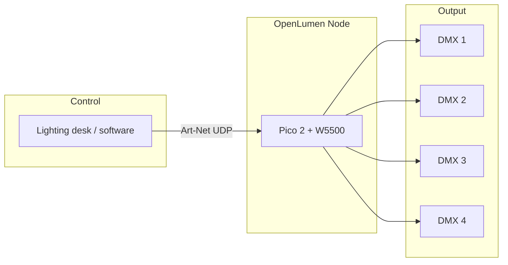

# OpenLumen Node

**Art-Net and DMX512 node for Raspberry Pi Pico 2**

Firmware and web UI to turn a Pico 2 and Ethernet into a 4-port Art-Net/DMX512 node you configure from a browser—no vendor lock-in, no cloud.

---

## What it is

OpenLumen Node is embedded firmware (Rust, [Embassy](https://embassy.dev)) and a web control UI (React) for an Art-Net/DMX512 node on Raspberry Pi Pico 2 (RP2350) with W5500 Ethernet and four DMX outputs. Configure network, Art-Net, and ports from any device on the same LAN.

---

## Features

- **4 DMX512 outputs** — PIO-based; no external UARTs
- **Art-Net 3 & 4** — Configurable net/subnet; source merging (HTP/LTP) per port
- **Web UI** — Network (DHCP or static), Art-Net settings, per-port config, live DMX view
- **Runs on** — Raspberry Pi Pico 2 (RP2350) with W5500 Ethernet (e.g. [WIZnet Pico2-W5500](https://www.wiznet.io/product-item/wiznet-pico-2-w5500/))
- **Persistent settings** — Stored in flash; survives reboot
- **Stack** — Rust, Embassy, [picoserve](https://github.com/sammhicks/picoserve); web UI built with React and Vite

---

## How it works

Your lighting software sends Art-Net over the network; the node receives it and drives four DMX512 outputs. Open the device’s IP in a browser to configure network, Art-Net, and port behaviour.

---

## Hardware

You need:

- **Raspberry Pi Pico 2** (RP2350)
- **W5500 Ethernet** — e.g. WIZnet Pico2-W5500 board
- **DMX carrier board** — compatible carrier with 4× DMX outputs (or your own design using the same pinout)

Pinout and hardware details depend on your carrier; see [Installation](docs/installation.md) for build prerequisites.

---

## Quick start

1. **Build the web UI**  
   `cd web_frontend && npm ci && npm run build:client`

2. **Build the firmware**  
   `cargo build --release`

3. **Flash the device**  
   Use `./build_and_flash.sh` or flash the UF2 manually (see below).

For prerequisites (Rust toolchain, target, Node, picotool), full build steps, and flashing, see **[Installation](docs/installation.md)**.

---

## Project

- **OpenLumen** — project and organisation name  
- **OpenLumen Node** — this product (firmware + web UI)

**Rights:** All rights reserved. See [COPYRIGHT](COPYRIGHT).

**Contributing:** We welcome contributions. See [Contributing](docs/CONTRIBUTING.md).

---

## Tech stack

| Layer    | Stack |
| -------- | ----- |
| Firmware | Rust, Embassy (async), picoserve (HTTP/WebSocket) |
| Target   | RP2350 (thumbv8m.main-none-eabihf) |
| Web UI   | React, Vite, TypeScript; built to static assets served by the device |
