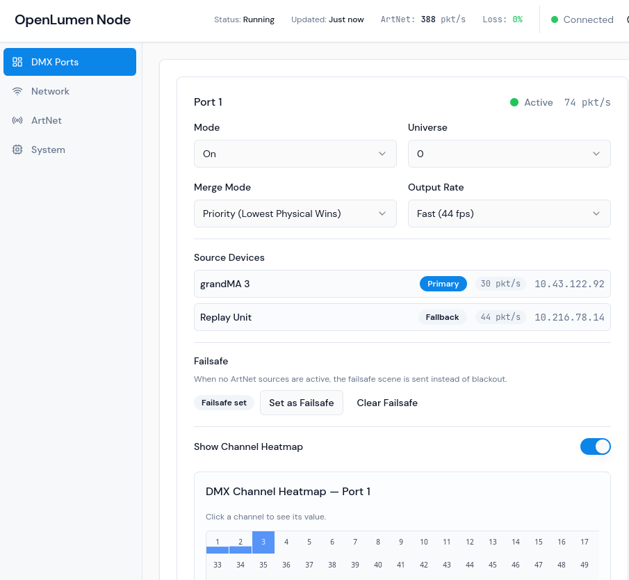
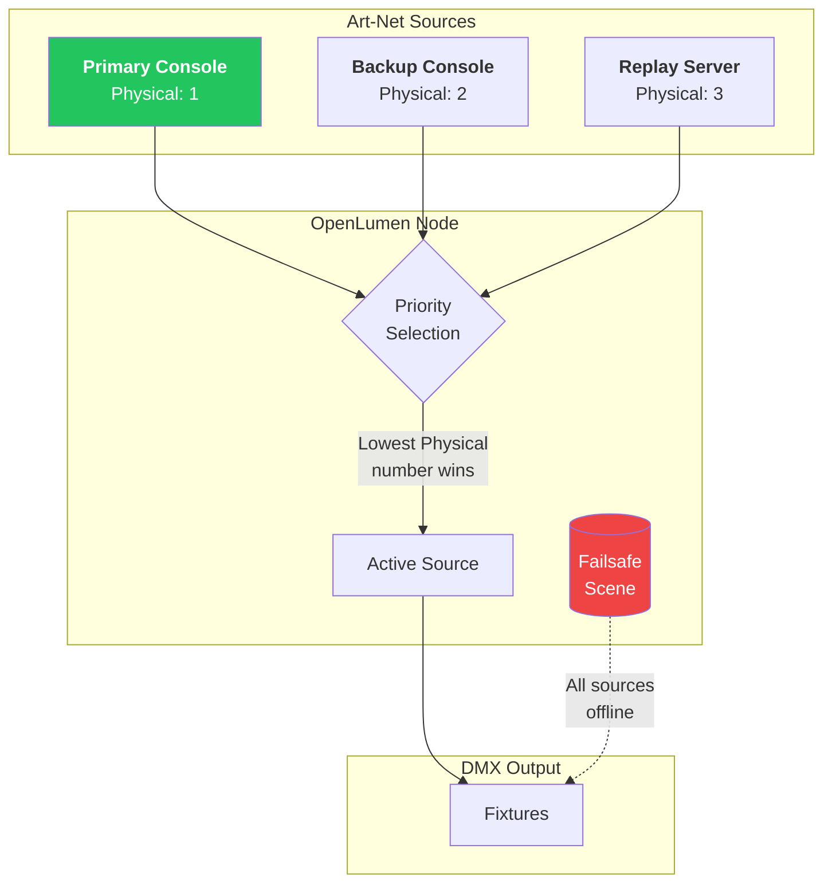
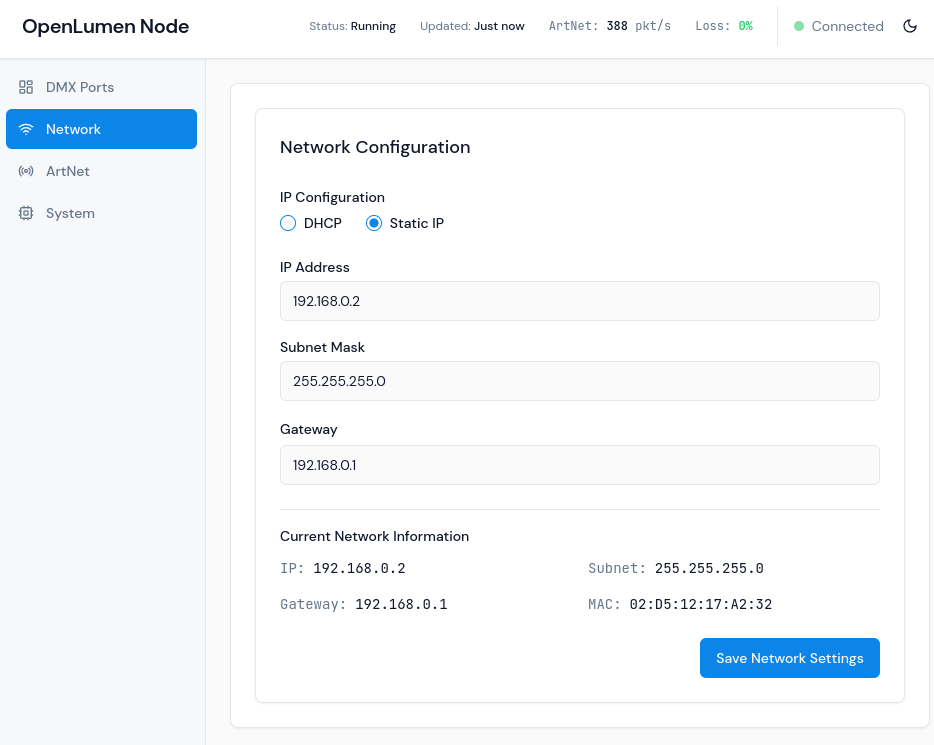
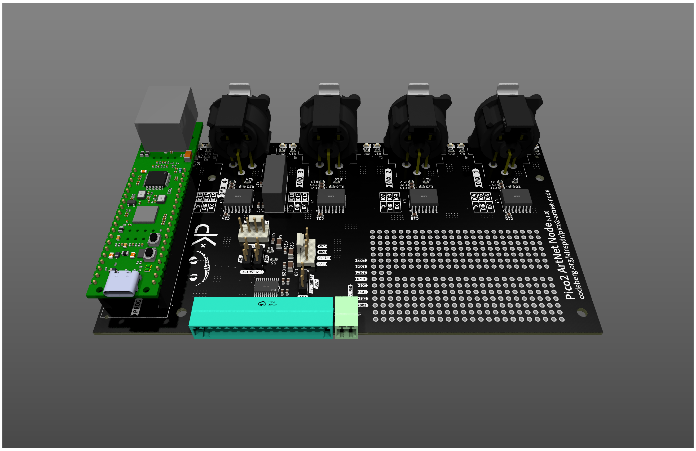

<h1 align="center">OpenLumen Node</h1>

<p align="center">
  <strong>OpenSource Art-Net to DMX512 node</strong><br>
  4 outputs · Priority merging · Failsafe · Web configuration
</p>

<p align="center">
  <a href="#features">Features</a> ·
  <a href="#priority-merging">Priority Merging</a> ·
  <a href="#web-interface">Web Interface</a> ·
  <a href="#hardware">Hardware</a> ·
  <a href="#quick-start">Quick Start</a>
</p>

---
<picture>
  <source media="(prefers-color-scheme: dark)" srcset="docs/screenshot_dmx_ports.png">
  <source media="(prefers-color-scheme: light)" srcset="docs/screenshot_dmx_ports.png">
  
</picture>
## Why OpenLumen Node

OpenLumen Node is a complete Art-Net to DMX512 solution built from the ground up in Rust for the Raspberry Pi Pico 2. It combines the reliability of embedded Rust with a modern web interface—no proprietary software, no cloud dependencies, no vendor lock-in.

| | |
|---|---|
| **Specification-compliant** | Full Art-Net 3 & 4 implementation with proper source merging, not a simplified subset |
| **Production-ready failover** | Priority-based source selection with automatic fallback and configurable failsafe scenes |
| **High performance** | PIO-driven DMX outputs at up to 44 fps; zero-copy packet processing in async Rust |
| **Configure from anywhere** | Responsive web UI served directly from the device. Works on any device with a browser |
| **Live DMX Preview** | See the current state of the DMX output in real time in the web UI |

---

## Features

### DMX Output
- **4 independent DMX512 outputs** — PIO-based transmission, no external UARTs required
- **Configurable refresh rate** — Standard (40 fps) or Fast (44 fps) per port
- **Per-port universe assignment** — Full Art-Net addressing with configurable Net/Subnet/Universe

### Source Merging
Three merge modes per port:
- **HTP** (Highest Takes Precedence) — Channel-by-channel maximum; standard for intensity
- **LTP** (Latest Takes Precedence) — Most recent packet wins; useful for position data
- **Priority** — Source with lowest Art-Net Physical number takes precedence

### Failover & Failsafe
- **Automatic source failover** — When primary source stops transmitting, fallback sources take over
- **Configurable failsafe scene** — When all sources go offline, output a predefined scene instead of blackout
- **Source timeout detection** — Configurable timeout before failover triggers

### Network
- **DHCP or static IP** — Configure via web interface
- **Art-Net discovery** — Responds to ArtPoll; appears in lighting software automatically
- **Real-time status** — Packet rate, packet loss percentage, and connection state

---

## Priority Merging

OpenLumen Node implements true Art-Net priority merging based on the Physical field in Art-Net packets. This enables robust multi-source setups with deterministic failover behavior.



**How it works:**

1. **Normal operation** — The source transmitting the lowest Physical number is selected as primary
2. **Primary failure** — If the primary stops transmitting, the next-lowest Physical source takes over automatically
3. **Complete failure** — If all sources go offline, the configurable failsafe scene is output instead of blackout

This approach mirrors professional broadcast and touring setups where a main console, backup console, and tracking backup each transmit with different Physical numbers—failover is instant and deterministic.

---

## Web Interface

Configure everything from a browser. The web UI is served directly from the device over HTTP, no app or cloud account needed.

<table>
<tr>
<td width="50%">

**DMX Ports**

- Per-port mode and universe configuration
- Merge mode selection (HTP / LTP / Priority)
- Live source device list with packet rates
- Real-time DMX channel heatmap
- Failsafe scene capture and restore

</td>
<td width="50%">

**Network**

- DHCP or static IP configuration
- Current network status display
- MAC address and gateway info

</td>
</tr>
<tr>
<td>

</td>
<td>

</td>
</tr>
</table>

---

## Hardware



OpenLumen Node runs on the **Raspberry Pi Pico 2** (RP2350) with W5500 Ethernet.

### Requirements

- **Raspberry Pi Pico 2** (RP2350)
- **W5500 Ethernet module** — e.g., [WIZnet Pico2-W5500](https://www.wiznet.io/product-item/wiznet-pico-2-w5500/)
- **DMX carrier board** — 4× DMX512 outputs with RS-485 transceivers

The carrier board design uses standard 3-pin XLR connectors with isolated RS-485 transceivers. Pinout and hardware files are documented in [Hardware](https://github.com/klnspdr/pico2-artnet-node).

<br clear="right"/>

---

## Quick Start

### Prerequisites

- Rust toolchain with `thumbv8m.main-none-eabihf` target
- Node.js 18+ and npm
- `picotool` for flashing

### Build

```bash
# Build the web UI
cd web_frontend && npm ci && npm run build:client && cd ..

# Build the firmware
cargo build --release

# Flash to device
./build_and_flash.sh
```

For detailed setup instructions, see **[Installation](docs/installation.md)**.

---

## Technical Details

| Layer | Technology |
|-------|------------|
| **Firmware** | Rust, [Embassy](https://embassy.dev) (async embedded), [picoserve](https://github.com/sammhicks/picoserve) (HTTP/WebSocket) |
| **Target** | RP2350 (`thumbv8m.main-none-eabihf`), Armv8-M Cortex-M33 |
| **DMX Output** | PIO state machines, zero-copy DMA transfers |
| **Web UI** | React, TypeScript, Vite — compiled to static assets served from flash |
| **Storage** | Wear-leveled flash filesystem for persistent configuration |

---

## Contributing

Contributions are welcome. Please read [CONTRIBUTING.md](docs/CONTRIBUTING.md) before submitting pull requests.

---

## License

See [COPYRIGHT](COPYRIGHT) for licensing information.

---

<p align="center">
  <strong>OpenLumen Node</strong>
</p>
